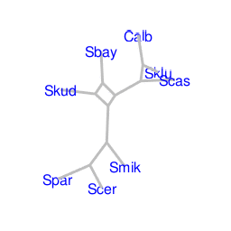

phangorn is an R package which allows you to    

- estimate phylogenies
- compare trees and models
- explore tree space and visualize phylogenetic trees and split graphs 

If you use phangorn please cite:

[Schliep K.P. 2011. phangorn: phylogenetic analysis in R. Bioinformatics, 27(4) 592-593](http://www.ncbi.nlm.nih.gov/pubmed/21169378)

---

- [Installation](pages/Installation.html)

---

---

Sources on [github](https://github.com):  

- The [development version](https://github.com/KlausVigo/phangorn)  

and on [CRAN](https://cran.r-project.org/):  

- [release version](http://cran.r-project.org/package=phangorn)

---

The site is based on Karl Bromans [simple site](http://github.com/kbroman/simple_site).
