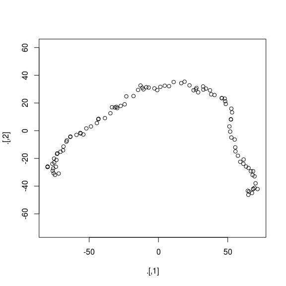
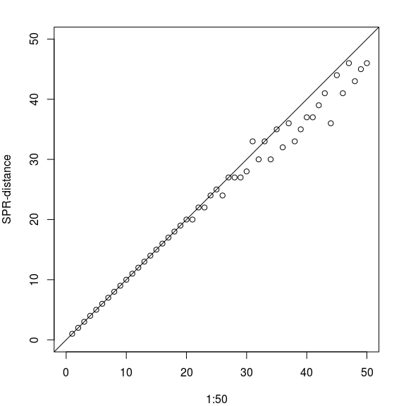

As you may have seen a version of *ape* and *phangorn* have been released. *ape* jumped to version 4.0 and you can see the changes [here](http://ape-package.ird.fr/NEWS).
Some of the nicest new features are that many useful functions for transforming `phylo` objects have been made generic. This includes functions like `is.rooted`, `unroot`, `reorder` `is.binary`, `is.ultrametric` or `di2multi` and these now work also on `multiPhylo` objects. 

In practice this means that instead of typing

    trees <- .uncompressTipLabel(trees)
    trees <- lapply(trees, "unroot")
    class(trees) <- "multiPhylo"

you can type just

    trees <- unroot(trees)

So your code will be much cleaner and shorter.

``` r
library(phangorn)
```

    ## Loading required package: ape

``` r
tree <- rtree(100)
trees <- tree
i <- 1
while(i<100){
    tree <- rNNI(tree, 2)
    trees <- c(trees, tree)
    i <- i+1
}
```

Now this is very inefficient, you should pre allocate the space for the trees, but it shows that the generic `c()` now works more general and can take a mixed input of `phylo` and `multiPhylo` objects.

So now even an old fashioned R user and non-[hipsteR](http://kbroman.org/hipsteR/) like me, can write some fancy R code:

``` r
library(magrittr)
trees %>% unroot %>% RF.dist %>% cmdscale %>% plot(asp=1)
```



And now to some of the new features in *phangorn*. I added some first lines of C++ to *phangorn*. I really should have made the transition much earlier to Rcpp. The source code is so much cleaner and shorter.

My good friend [Leo](http://www.leomartins.org/) joined the authors of phangorn and has contributed the function `SPR.dist`, which is a nice addition to the other tree distances already available. As the name suggests it computes the (approximate) SPR distance (see de Oliveira Martins et al. (2008, 2016)).

``` r
tree <- rtree(200, rooted=FALSE)
trees <- rSPR(tree, 1:50)
y <- SPR.dist(tree, trees)
par("mar" = c(4,4,2,2))
plot(1:50, y, xlim=c(0, 50), ylim=c(0, 50), asp=1, ylab="SPR-distance")
abline(a=0, b=1)
```



The minimal number of SPR steps between 2 trees may actually be less than we used to construct, so the results are even better. It is also reasonable fast and there are not so many programs around which compute it.

Additionally the plotting of phylogenetic networks is looking much nicer and it got easier to import and export networks from and to *Splitstree*, but more will be in another post soon.

### References

de Oliveira Martins L., Leal E., Kishino H. (2008) *Phylogenetic Detection of Recombination with a Bayesian Prior on the Distance between Trees.* PLoS ONE **3(7)**. e2651. doi: 10.1371/journal.pone.0002651

de Oliveira Martins L., Mallo D., Posada D. (2016) *A Bayesian Supertree Model for Genome-Wide Species Tree Reconstruction.* Syst. Biol. **65(3)**: 397-416, <doi:10.1093/sysbio/syu082>
