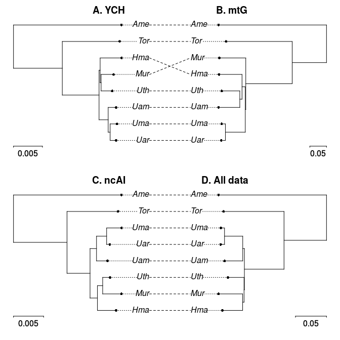

[comment]: # (output: html_document)


---
nocite: | 
  @Schliep2017
...

```{r setup, echo=FALSE}
# set global chunk options: images will be bigger
  knitr::opts_chunk$set(fig.width=6, fig.height=6)
#, global.par=TRUE
options(digits = 4)

knitr::knit_hooks$set(small.mar=function(before, options, envir){
   if (before && options$fig.show!='none') par(mar=c(.5,.5,.5,.5))
})
```


*Description:* This script provides examples of the new functions available in the phangorn library to 'intertwine' trees and networks, i.e. compare trees and networks and data transference. It also provides a step-by-step guide for users new to R. 

*Methodological advancement:* The major advancement in this phangorn update is the introduction of a generic network object with a wide range of related transfer and analysis functions. These new functions provide the first means to directly transfer information amongst a wide range of phylogenetic trees and networks, as well as means to visualize and further analyze this information. This should provide a platform for individuals to easily conduct tree-network comparisons and stimulate further function development by the community.

*What next?:* By implementing full network handling compatibility in R, and providing exemplar scripts (such as this) and [support](https://github.com/KlausVigo/phangorn), the scientific community now has an easy means to analyse and compare the results of phylogenetic trees vs. network approaches. We hope this will open a largely unexplored world to the general phylogenetic audience. 


### Installing R                                                 
1. Download R                                                     
 Select the nearest mirror to your location at https://cran.r-project.org/mirrors.html                          
2. Select your operating system and download the relevant installation file.                                             
3. Install R following the instructions.                          

### Installing the phangorn library                                 
Open R and run the two lines of code below in the command line.   
(You will need to select a region from which to download the library)                       
```{r, eval=FALSE}
install.packages("phangorn", dependencies=TRUE)
# install latest development version needs devtools
install.packages("devtools", dependencies=TRUE)
library(devtools)
install_github("KlausVigo/phangorn")
```


### Getting started                                                  
```{r}
library(phangorn)    # load the phangorn library
```

### Set the working directory
This is often a major stumbling block for new R users. You need to specify where in your folder structure you wish to work. i.e, where are the files stored that you wish to input?

This is done using the `setwd()` function, e.g. `setwd("C:/TreesNetworks/Example Files")`.

We now set it to the folder of the phangorn package, which contains the files we want to load for this example.

### Read in the example file datasets:
This example files are based on the woodmouse dataset available in the ape library. Ultimately, this dataset is from this study: Michaux, J. R., Magnanou, E., Paradis, E., Nieberding, C. and Libois, R. (2003) 
Mitochondrial phylogeography of the Woodmouse (*Apodemus sylvaticus*) in the Western 
Palearctic region. Molecular Ecology, 12, 685-697.)
 
```{r} 
## automatically set the correct working directory for the examples below
# setwd(system.file("extdata/trees", package = "phangorn"))
# for this vignette we create a path to the files we want to load 
fdir <- system.file("extdata/trees", package = "phangorn")
## in your case it may look something like this...
# setwd("C:/TreesNetworks/Example Files")

##DNA Matrix, maybe not needed 
woodmouse <- read.phyDat(file.path(fdir, "woodmouse.fasta"),format="fasta") 
## RAxML best-known tree with bipartition support (from previous analysis)
raxml.tree <- read.tree(file.path(fdir,"RAxML_bipartitions.woodmouse"))
## RAxML bootstrap trees (from previous analysis)
raxml.bootstrap <- read.tree(file.path(fdir,"RAxML_bootstrap.woodmouse"))
## MrBayes consensus tree (50% majority rule) (from previous analysis)
mrbayes.tree <- read.nexus(file.path(fdir,"woodmouse.mrbayes.nex.con"))
## MrBayes sample runs 1 and 2 (from previous analysis)
run1 <- read.nexus(file.path(fdir,"woodmouse.mrbayes.nex.run1.t"))
run2 <- read.nexus(file.path(fdir,"woodmouse.mrbayes.nex.run2.t"))
## How many trees are in the MrBayes tree sample?
run1
run2
## Combining the two runs and removing 25% burn-in
mrbayes.trees <- c(run1[251:1001],run2[251:1001])
## NeigbourNet Nexus file generated by SplitsTree (from previous analysis)
Nnet <- read.nexus.networx(file.path(fdir,"woodmouse.nxs"))
```
All example files read into R.

### Viewing the data   
```{r}
par(mfrow=c(1,2), mar=c(1,1,1,1)) # Setting plot parameters
### Plotting trees with support values:
##  RAxML
plot(raxml.tree)
nodelabels(raxml.tree$node.label, adj = c(1, 0), frame = "none")
##  MrBayes
plot(mrbayes.tree)
nodelabels(mrbayes.tree$node.label, adj = c(1, 0), frame = "none")

par(mfrow=c(1,1)) # Setting plot parameters
# NeighborNet
plot(Nnet,"2D")
## alternatively,
# plot(Nnet,"2D")

```

### Intertwining trees and network functions                         
### 1A: 
Identification of edge bundles (in black) in a neighbor-net (NN) network that correspond to branches (labelled 1-12) in a tree (a maximum likelihood tree, in this case). 

```{r, fig.width=7, fig.height=4, small.mar=TRUE} 
# create a vector of labels for the network corresponding to edges in the tree
edge.lab <- createLabel(Nnet, raxml.tree, raxml.tree$edge[,2], "edge")
# could be also 1:27 instead of raxml.tree$edge[,2]

# Show the correspondingly labelled tree and network in R
par(mfrow=c(1,2))  
plot(raxml.tree, "u", rotate.tree = 180, cex=.7) 
edgelabels(raxml.tree$edge[,2],col="blue", frame="none", cex=.7)

# find edges that are in the network but not in the tree
edge.col <- rep("black", nrow(Nnet$edge))
edge.col[ is.na(edge.lab) ] <- "red"
# or a simpler alternative...
edge.col <- createLabel(Nnet, raxml.tree, "black", nomatch="red")

x <- plot(Nnet, edge.label = edge.lab, show.edge.label = T, "2D", 
          edge.color = edge.col, col.edge.label = "blue", cex=.7)
# the above plot function returns an invisible networx object and this object 
# also contains the colors for the edges.

```


### 1B: 
Bootstrap support for all branches (branch labels) in the ML tree mapped on the corresponding edge bundles of the NN network. The edges in the network which are not found as ML tree branches are highlighted in red.
```{r, small.mar=TRUE}   
# the scaler argument multiplies the confidence values. This is useful to switch
# confidences values between total, percentage or ratios.   
x <- addConfidences(Nnet,raxml.tree, scaler = .01)
# find splits that are in the network but not in the tree
split.col <- rep("black", length(x$splits))
split.col[ !matchSplits(as.splits(x), as.splits(raxml.tree)) ] <- "red"

# simpler alternative...
split.col2 <- createLabel(x, raxml.tree, label="black", "split", nomatch="red")

# Plotting in R
out.x <- plot(x,"2D",show.edge.label=TRUE, split.color=split.col, 
              col.edge.label = "blue")
```

Again we can write to SplitsTree for viewing...
```{r}
# write.nexus.networx(out.x,"woodmouse.tree.support.nxs")
## or we can also export the splits alone (for usage in software other than SplitsTree)
# write.nexus.splits(as.splits(out.x),"woodmouse.splits.support.nxs")
```

### 1C: 
Frequencies of bipartitions found in the bootstrap pseudoreplicates mapped on the corresponding edge bundles of the NN network using a threshold of 10% (i.e. any edge is labelled that occurs in at least 
100 of the 1000 ML-BS pseudoreplicates). Edge bundles not found in the ML tree are labelled using grey edges.

```{r, small.mar=TRUE}
y <- addConfidences(Nnet, as.splits(raxml.bootstrap))
edge.col <- createLabel(y, raxml.tree, label="black", "edge", nomatch="grey")

y <- plot(y,"2D",show.edge.label=TRUE, edge.color=edge.col)

## Write to SplitsTree for viewing
# write.nexus.networx(y,"NN.with.bs.support.nxs")
```

### Extras...
We can also compare the neighborNet with a consensusNet (Holland BR, Huber KT, Moulton V, Lockhart PJ,2004, Using consensus networks to visualize contradictory evidence for species phylogeny. Molecular Biology and Evolution, 21, 1459-1461). Furthermore, we can extract the support values from the consensus network, and place these on to the NeighborNet (this is similar to the process explained in 1C above).
```{r, small.mar=TRUE}
cnet <- consensusNet(raxml.bootstrap,prob=0.10)
edge.col <- createLabel(cnet, Nnet, label="black", "edge", nomatch="grey")
cnet <- plot(cnet, "2D", show.edge.label = TRUE, edge.color=edge.col)

edge.col <- createLabel(Nnet, cnet, label="black", "edge", nomatch="grey")
z <- plot(Nnet, "2D", show.edge.label = TRUE, edge.color=edge.col)

obj <- addConfidences(Nnet,cnet)
plot(obj,"2D",show.edge.label=T, edge.color=edge.col, col.edge.label = "blue")

## Write to SplitsTree for viewing
# write.nexus.networx(obj,"Nnet.with.ML.Cnet.Bootstrap.nxs")
```


### 
There are four possible data patterns in phylogenetic reconstruction: (1) patterns that are well supported in the network and appear in the bootstrapped trees; (2) patterns that are well supported by (part of) the data/network but do not appear in the optimized trees, i.e. they are incompatible with the tree; (3) patterns that are weakly supported by the network but appear in the optimized trees anyway, i.e. they are compatible with the tree. 

Here we demonstrate these patterns by showing the relationships between splits weights, from a NeighborNet splits graph, bootstrap bipartitions support and bootstrap percentages plotted on the optimized tree for a dataset of @Wang2012. 

(An advanced user figure...)
```{r, fig.width=7, fig.height=6}
Nnet <- read.nexus.networx(file.path(fdir,"RAxML_distances.Wang.nxs"))
raxml.tree <- read.tree(file.path(fdir,"RAxML_bestTree.Wang.out")) |> unroot()
raxml.bootstrap <- read.tree(file.path(fdir,"RAxML_bootstrap.Wang.out"))

bs_splits <- as.splits(raxml.bootstrap)
tree_splits <- as.splits(raxml.tree) |> unique() |> removeTrivialSplits()
# we overwrite bootstrap values and set the weights 
# to 1e-6 (almost zero), as we plot them on a log scale later on
attr(bs_splits, "weights")[] <- 1e-6
# combine the splits from the bootstrap and neighbor net
# and delete duplicates and add the confidence values
# we get rid of trivial splits
all_splits <- c(Nnet$splits, bs_splits) |> unique() |> removeTrivialSplits() |> 
  addConfidences(bs_splits, scaler=100)

# For easier plotting we create a matrix with the confidences and 
# weights as columns
tab <- data.frame(SplitWeight = attr(all_splits, "weights"), 
                  Bootstrap=attr(all_splits, "confidences"), Tree=FALSE)
# we add a logical variable pto indicate which splits are in the RAxML tree
tab$Tree[matchSplits(tree_splits, all_splits, FALSE)] <- TRUE

tab[is.na(tab[,"Bootstrap"]),"Bootstrap"] <- 0
tab[,"Bootstrap"] <- round(tab[,"Bootstrap"])
rownames(tab) <- apply(as.matrix(all_splits, zero.print = ".", one.print = "|"), 
                       1, paste0, collapse="")
tab[1:10,]

col <- rep("blue", nrow(tab))
col[tab[,"Bootstrap"]==0] <- "green"
col[tab[,"SplitWeight"]==1e-6] <- "red"

pch <- rep(19, nrow(tab))
pch[tab$Tree] <- 17

par(mar=c(5.1, 4.1, 4.1, 8.1), xpd=TRUE)
plot(tab[,"SplitWeight"], tab[,"Bootstrap"], log="x", col=col, pch=pch,  
     xlab="Split weight (log scale)", ylab="Bootstrap (%)")
legend("topright", inset=c(-0.35,0), c("Pattern 1", "Pattern 2", "Pattern 3", 
                       "Pattern in the\nbest tree"), pch=c(19,19,19,17), 
                       col=c("blue", "green", "red", "black"), bty="n")
```

### Figure 4

```{r} 
YCh <- read.tree(file.path(fdir, "RAxML_bestTree.YCh")) 
mtG <- read.tree(file.path(fdir, "RAxML_bestTree.mtG")) 
ncAI <- read.tree(file.path(fdir, "RAxML_bestTree.AIs")) 
all_data <- read.tree(file.path(fdir, "RAxML_bestTree.3moles")) 
YCh_boot <- read.tree(file.path(fdir, "RAxML_bootstrap.YCh")) 
mtG_boot <- read.tree(file.path(fdir, "RAxML_bootstrap.mtG")) 
ncAI_boot <- read.tree(file.path(fdir, "RAxML_bootstrap.AIs")) 
all_data_boot <- read.tree(file.path(fdir, "RAxML_bootstrap.3moles")) 
```

There are several option plotting a co-phylogeny. In the following we use the 
`cophylo` function of the `phytools` package. 


```
library(phytools)
par(mfrow=c(2,1))
obj <- cophylo(YCh, mtG) 
plot(obj, mar=c(.1,.1,2,.1),scale.bar=c(.005,.05), ylim=c(-.2,1))  
title("A. YCh                                    B. mtG")
obj <-  cophylo(ncAI, all_data)
plot(obj, mar=c(.1,.1,2,.1),scale.bar=c(.005,.05), ylim=c(-.2,1))
title("C. ncAI                              D. All data")
```

Unfortunately this function does not (yet) offer to add confidences 
to some splits, but we can do this easily with more basic plot functions. 
```{r}
par(mfrow=c(2,2), mar = c(2,2,4,2))
YCh <- plotBS(midpoint(YCh), YCh_boot, "phylogram", p=0, main = "YCh")
mtG <- plotBS(midpoint(mtG), mtG_boot, "phylogram", p=0, main = "mtG")
ncAI <- plotBS(midpoint(ncAI), ncAI_boot, "phylogram", p=0, main = "ncAI")
all_data <- plotBS(midpoint(all_data), all_data_boot, "phylogram", p=0, 
                   main = "All data")
```

We can compare this with consensus network with the different bootstrap values for the different genes. 
```{r, small.mar=TRUE}
par(mfrow=c(1,1))
cn <- consensusNet(c(YCh, mtG, ncAI))
cn <- addConfidences(cn, YCh_boot) |> addConfidences(mtG_boot, add=TRUE) |> 
  addConfidences(ncAI_boot, add=TRUE) |> addConfidences(all_data_boot, add=TRUE)
plot(cn, "2D", show.edge.label=TRUE)
```

